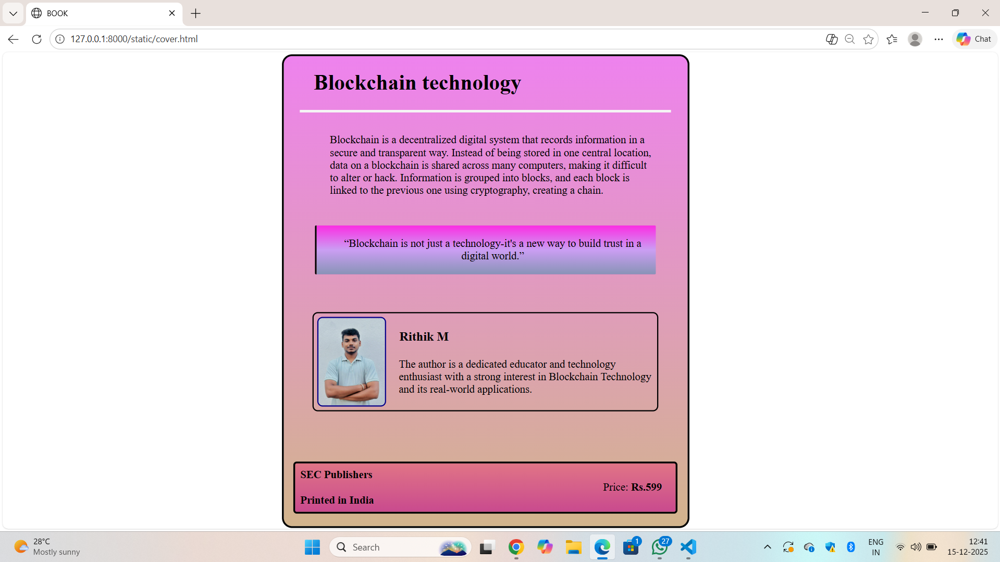

# Ex.05 Book Cover Page Design
## Date:15.12.25

## AIM:
To design a book back cover page using HTML and CSS.

## DESIGN STEPS:

### Step 1:
Create a Django Admin project.

### Step 2:
Create an app in the Django interface.

### Step 3:
Create a folder named 'static' in the app folder.

### Step 4:
Create a new HTML file in the static folder.

### Step 5:
Write the HTML code with relevant CSS properties.

### Step 6:
Choose the appropriate style and color scheme.

### Step 7:
Insert the images in their appropriate places.

### Step 8:
Publish the website in the LocalHost.

## PROGRAM:
```
cover.html:
<html>
    <head>
        <title>BOOK</title>
        <link href="styles.css" rel="stylesheet">
    </head>
    <body>
        <div class="r1">
            <h1>Blockchain technology</h1>
            <hr size="3" color="whitesmoke">
            
        <div class="r2">
            <p>Blockchain is a decentralized digital system that records information in a secure and transparent way. Instead of being stored in one central location, data on a blockchain is shared across many computers, making it difficult to alter or hack. Information is grouped into blocks, and each block is linked to the previous one using cryptography, creating a chain.</p>
        </div><br>
        <div class="quotes"><p><q>Blockchain is not just a technology-it's a new way to build trust in a digital world.</q></p></div>
        <br><br><br>
        <div class="r3">
            
            <div class="info">
                <h3>Rithik M</h3>
        
                <p>The author is a dedicated educator and technology enthusiast with a strong interest in Blockchain Technology and its real-world applications.</p>
            </div>
        </div>
        <br><br><br><br>
        <div class="r4">
            <span><b>SEC Publishers</b></span>
            <div class="amount">
                <span>Price: </span><span><b>Rs.599</b></span>
            </div>
            <span><b>Printed in India</b></span>
        </div>
        <br>
    </body>
</html>

styles.css:
.r1
{
    width:600px;
    border: solid 3px;
    margin: auto;
    border-radius: 15px;
    background:linear-gradient(violet,tan)
}
.r2
{
    width: 500;
    margin-left: 80px;
    display: flex;
    margin: auto;
    padding:8px;
}
.r3
{
    margin: auto;
    width: 500px;
    border: solid 2px black;
    display: flex;
    border-radius: 8px;
    padding: 5px;
}
.info
{
    display: flex;
    flex-direction: column;
}
h1{
    margin:auto;
    padding: 15px;
    margin-left: 30px;
    margin-bottom: 5px;
    margin-top: 5px;
}
img{
    height: 130px;
    width: 120px;
    
}
h3{
    margin-left: 15px;
    margin-left: 20px;
    margin-bottom: 5px;
}
h4
{
    margin-left: 15px;
}
.r4
{
    width: 550px;
    margin:auto;
    background:linear-gradient(rgb(224, 116, 134),rgb(201, 74, 142));
    border: solid 3px;
    border-radius: 5px;
    padding:8px;
}
.amount
{
    padding-left:450px;
}

hr{
    align-self: auto;
    width: 550;
}
h2
{
    margin-left: 15px;
}


.quotes{
    margin:auto;
    background:linear-gradient(rgb(251, 44, 227),rgb(203, 158, 243),rgb(135, 147, 182));
    padding: 2px;
    border-radius: 2px;
    border-left: solid 3px black;
    text-align: center;
    width:500px;
}
.r3 img
{
    border-radius: 8px;
    object-fit: cover;
    border: 2px solid darkblue
}
p{
    padding-left: 19px;
}


```

## OUTPUT:


## RESULT:
The program for designing book back cover page using HTML and CSS is completed successfully.
